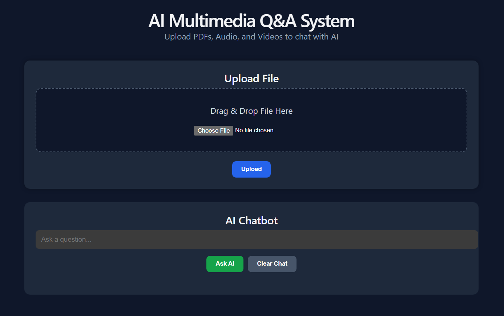
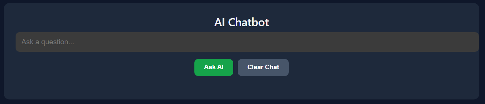
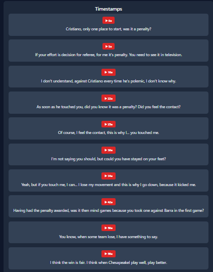

# AI Multimedia Q&A System

## Overview

AI Multimedia Q&A System is a full-stack AI-powered web application that allows users to upload PDFs, audio, and video files and interact with them using a chatbot powered by Retrieval-Augmented Generation (RAG).

The system extracts text from documents, transcribes audio/video using Whisper, stores embeddings using FAISS, and generates contextual answers using a local Large Language Model through Ollama.

---

# Features

- Upload PDF, MP3, WAV, and MP4 files
- AI-powered chatbot for multimedia content
- Whisper-based audio/video transcription
- PDF text extraction
- Timestamp-based navigation for audio/video
- FAISS vector similarity search
- SentenceTransformer embeddings
- MongoDB integration
- Multimedia preview support
- Responsive modern React frontend
- FastAPI backend
- Local LLM integration using Ollama

---

# Tech Stack

## Frontend

- React
- Vite
- JavaScript
- CSS

## Backend

- FastAPI
- Python

## AI / Machine Learning

- Ollama
- Gemma 2B
- Whisper
- SentenceTransformers
- FAISS

## Database

- MongoDB

---

# System Architecture

```text
User Upload
     ↓
FastAPI Backend
     ↓
Text Extraction / Whisper Transcription
     ↓
Sentence Embeddings
     ↓
FAISS Vector Database
     ↓
Relevant Context Retrieval
     ↓
Ollama LLM (Gemma 2B)
     ↓
AI Response
```

---

# Project Structure

```text
ai-multimedia-qa/
│
├── backend/
│   ├── app/
│   │   ├── routes/
│   │   ├── services/
│   │   ├── database/
│   │   └── main.py
│   │
│   ├── uploads/
│   ├── requirements.txt
│   └── Dockerfile
│
├── frontend/
│   ├── src/
│   ├── public/
│   └── package.json
│
└── README.md
```

---

# Installation

## Backend Setup

### Clone Repository

```bash
git clone <repository-url>
```

### Navigate to Backend

```bash
cd backend
```

### Create Virtual Environment

```bash
python -m venv venv
```

### Activate Virtual Environment

#### Windows

```bash
venv\Scripts\activate
```

#### Linux / Mac

```bash
source venv/bin/activate
```

### Install Dependencies

```bash
pip install -r requirements.txt
```

### Run Backend Server

```bash
uvicorn app.main:app --reload
```

Backend will run on:

```text
http://127.0.0.1:8000
```

---

# Frontend Setup

## Navigate to Frontend

```bash
cd frontend
```

## Install Dependencies

```bash
npm install
```

## Run Frontend

```bash
npm run dev
```

Frontend will run on:

```text
http://localhost:5173
```

---

# MongoDB Setup

Make sure MongoDB is installed and running locally.

Default connection:

```text
mongodb://localhost:27017
```

---

# Ollama Setup

Install Ollama from:

https://ollama.com/

Pull Gemma model:

```bash
ollama pull gemma:2b
```

Run model:

```bash
ollama run gemma:2b
```

---

# API Endpoints

## Upload File

```http
POST /upload
```

Supported formats:
- PDF
- MP3
- WAV
- MP4

---

## Chat with AI

```http
POST /chat?question=
```

Example:

```http
POST /chat?question=What is the video about?
```

---

## Generate Summary

```http
GET /summary
```

---

# Screenshots


## Home Page



## Upload Section


## Chatbot Interface



## Timestamp Navigation


---

# Future Improvements

- User authentication
- Cloud deployment
- Real-time streaming
- Multi-user support
- Better transcript formatting
- Conversation history
- Drag-and-drop multiple uploads
- Advanced vector databases

---

# Challenges Faced

- Managing local LLM memory limitations
- Improving vector retrieval accuracy
- Handling Whisper transcription errors
- Preventing hallucinated AI responses
- Optimizing FAISS similarity search

---

# Learning Outcomes

- Retrieval-Augmented Generation (RAG)
- FastAPI backend development
- React frontend development
- FAISS vector databases
- Sentence embeddings
- Whisper transcription
- Local LLM deployment with Ollama
- MongoDB integration

---

# Author

## Akhil Raj R

AI Multimedia Q&A System Project
